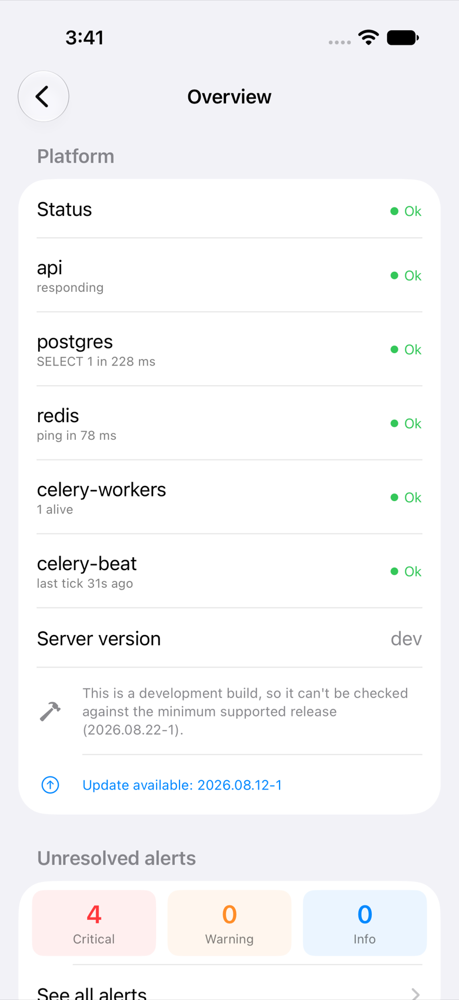
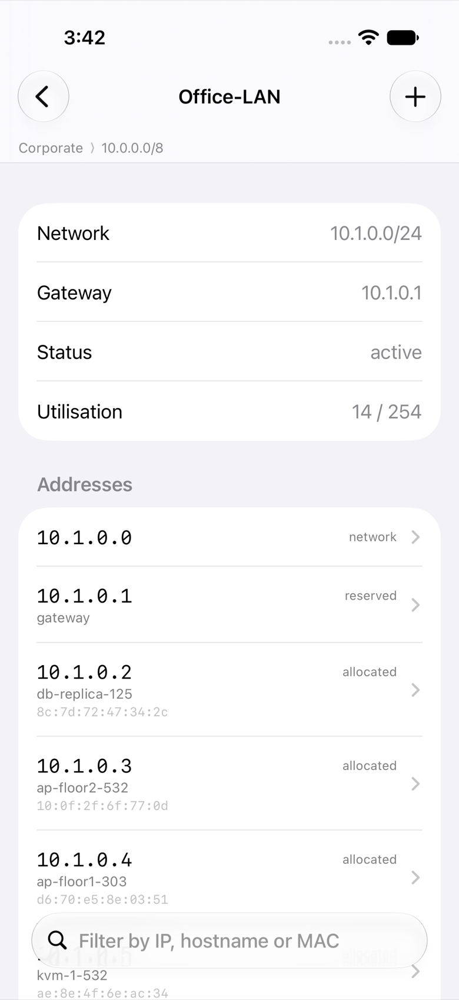
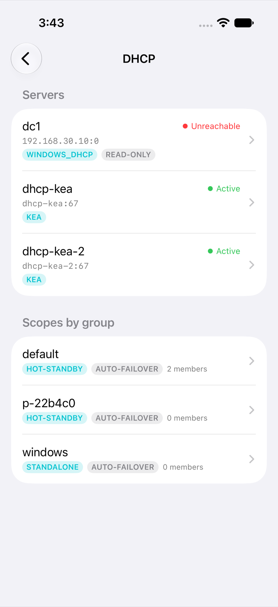
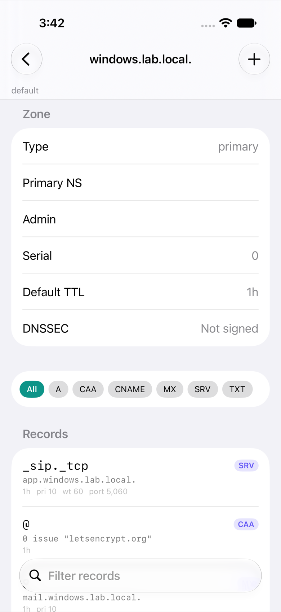
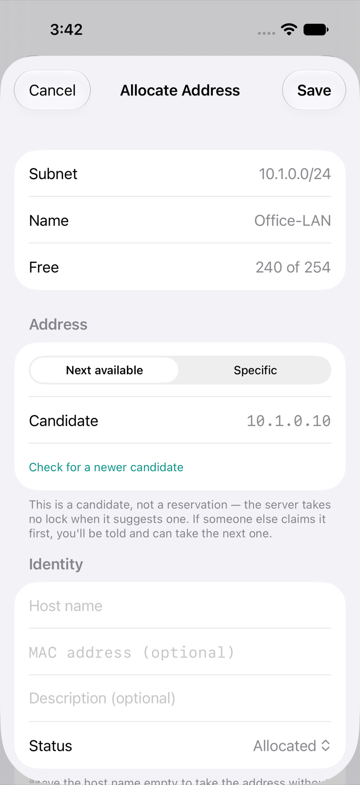
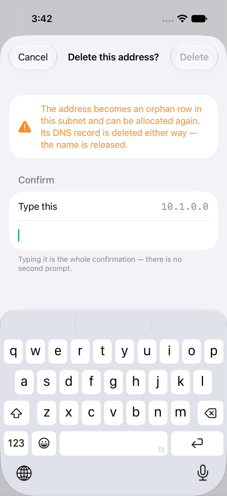

<h1 align="center">SpatiumDDI Mobile</h1>

<p align="center">
  <strong>Your DNS, DHCP and IPAM estate, on the phone in your pocket.</strong><br/>
  A native iOS client for <a href="https://github.com/spatiumddi/spatiumddi">SpatiumDDI</a> — built for the operator who is away from the console.
</p>

<p align="center">
  <a href="https://github.com/spatiumddi/spatiumddi-mobile/actions/workflows/ci.yml"></a>
  <a href="https://github.com/spatiumddi/spatiumddi-mobile/actions/workflows/security.yml"></a>
  <a href="LICENSE"></a>
  
  
  
</p>

---

<p align="center">
  <picture>
    <source media="(prefers-color-scheme: dark)" srcset="docs/screenshots/overview-dark.png">
    
  </picture>
  <picture>
    <source media="(prefers-color-scheme: dark)" srcset="docs/screenshots/ipam-subnet-dark.png">
    
  </picture>
  <picture>
    <source media="(prefers-color-scheme: dark)" srcset="docs/screenshots/dhcp-servers-dark.png">
    
  </picture>
</p>
<p align="center"><sub>Captured from the app running against a live control plane — by
<code>ScreenshotUITests</code>, not a mockup. They follow your colour scheme.</sub></p>

---

> **Read-mostly, and honest about it.** Everything below that says it works has
> been run against a real control plane. The app writes in exactly two places —
> taking an address in a subnet, and adding a record to a zone — and both are
> confirmed before anything is sent. Everything else is read-only by design, not
> by omission. See [Roadmap](#roadmap).

---

## What this is

The web console is where you *do* DDI work. This is where you *check* it.

Every screen here answers a question you'd otherwise need a laptop for:

- Did that change actually land, or is the daemon still serving the old config?
- Is the DHCP pool that page-out was about actually exhausted?
- What is `10.40.12.68`, and who has had it before?
- Is anything on fire right now?
- Can the *server* reach that host, resolve that name, open that port?

That last one is why the diagnostics run on the control plane rather than on
the phone. Your phone is on Wi-Fi, or a VPN, or a mobile network, and none of
those is where the service lives — so a ping from your pocket answers a
question nobody asked.

It talks to a SpatiumDDI control plane over its public REST API and contains no
server-side code. **This repo is a client of a contract it does not own** — the
platform, the API and the roadmap all live in
[spatiumddi/spatiumddi](https://github.com/spatiumddi/spatiumddi).

## What works today

| Surface | What you get |
|---|---|
| **Overview** | Platform health per component, maintenance/demo banners, server version and update check, unresolved alerts by severity, estate counts, and a size-weighted utilisation figure with the busiest subnets |
| **Alerts** | Every alert event, most-severe first, filterable by severity and unresolved-only |
| **IPAM** | The full tree — space → block → subnet → address — with utilisation at every level, and a per-address detail screen covering identity, fingerprinted device, last-seen signal and the DNS/DHCP objects linked to it. **Allocate** an address (next-available or specific, named and published to DNS in the same request), **edit** what it says about itself, **delete** it behind a typed confirmation |
| **DNS** | Group → zone → record, with SOA facts, DNSSEC state and serial per zone, and record filtering by type or substring. **Add, edit and delete records** — A, AAAA, CNAME, TXT, MX, SRV, NS, PTR, CAA — each stated in zone-file form before it is sent |
| **DHCP** | Server health and HA state, a live ACK/NAK traffic chart, leases with fingerprinted device class, and scopes with their pools and reservations |
| **Network Tools** | Ping, traceroute, MTR, port test, dig, propagation check, TLS certificate, WHOIS, MAC vendor and Wake-on-LAN — all run **from the control plane**, which is the vantage point that makes them worth having |
| **Search** | Global search across 16 resource types, grouped by kind, ranked server-side |
| **Connect** | HTTPS-only, with an explicit certificate-trust flow for the private CAs self-hosted installs actually use |
| **Sign in** | Per-device `sddi_` API token, by paste or by scanning the enrolment QR code, stored in the Keychain behind Face ID / Touch ID — or the device passcode, on hardware that has no biometrics, with the trade-off stated rather than silently taken |
| **Servers** | As many control planes as you run, each with its own name, token and pinned certificate. Switching tears the session down; nothing is shared or aggregated between them |

Navigation is a grouped sidebar — **Monitor / Estate / Network /
Administration / Tools** — which is a real sidebar on iPad and collapses to a
pushed list on iPhone. Sections whose optional platform module is switched off
are not shown at all.

<p align="center">
  <picture>
    <source media="(prefers-color-scheme: dark)" srcset="docs/screenshots/dns-records-dark.png">
    
  </picture>
  <picture>
    <source media="(prefers-color-scheme: dark)" srcset="docs/screenshots/ipam-allocate-dark.png">
    
  </picture>
  <picture>
    <source media="(prefers-color-scheme: dark)" srcset="docs/screenshots/delete-gate-dark.png">
    
  </picture>
</p>
<p align="center"><sub>The write story: browse it, take an address, and a delete that makes
you type what you are deleting — because the retraction reaches every server before the
sheet has dismissed.</sub></p>

## Roadmap

Phasing follows [spatiumddi#884](https://github.com/spatiumddi/spatiumddi/issues/884),
and the roadmap itself lives on
[this tracker](https://github.com/spatiumddi/spatiumddi-mobile/issues?q=is%3Aissue+is%3Aopen+label%3Aroadmap),
filterable by label: `phase-2` / `phase-3` / `phase-4` for the phases,
**`parity`** for what the web console has that the app does not yet,
**`mobile-native`** for what only exists because this is a phone, and
**`blocked-upstream`** for what needs the platform to move first. Work the
*platform* has to do is still filed upstream — the split is by who does the
work, and everything the app does belongs here.

### Phase 1 — read-mostly ✅

Sign-in, dashboard and health, global search, IPAM browse, DNS zone/record view,
DHCP scope/lease view, alert list. Plus the native niceties: pull-to-refresh,
biometric unlock, QR enrolment.

### Phase 2 — a small set of writes 🚧

Acknowledge and resolve alerts, approve change requests, allocate the next free
IP, toggle maintenance mode. Approvals-on-the-go is the best mobile write story
there is; the rest of the platform's surface stays desktop work.

**Landed:** allocating an address and creating a DNS record
([#7](https://github.com/spatiumddi/spatiumddi-mobile/issues/7)); editing and
deleting both ([#8](https://github.com/spatiumddi/spatiumddi-mobile/issues/8)).

**Next**, one issue each: resolve an alert
([#9](https://github.com/spatiumddi/spatiumddi-mobile/issues/9)), act on change
requests ([#10](https://github.com/spatiumddi/spatiumddi-mobile/issues/10)),
toggle maintenance mode
([#11](https://github.com/spatiumddi/spatiumddi-mobile/issues/11)), acknowledge
new-device sightings
([#12](https://github.com/spatiumddi/spatiumddi-mobile/issues/12)), and revoke
a lost device's token
([#13](https://github.com/spatiumddi/spatiumddi-mobile/issues/13)).

Every write is confirmed, and the confirmation names the actual thing — the
address and the subnet, or the record in zone-file form — rather than asking
"are you sure". No destructive action lands on a single tap: this is an app for
changing production DNS and DHCP from a phone, one-handed, possibly on a train.

Two behaviours are worth knowing about, because they are the ones that bite:

- **`next-ip-preview` hands out a candidate, not a reservation.** It takes no
  lock. Two people looking at once see the same address and the first to submit
  wins; the app says so up front and reports losing the race plainly instead of
  appearing to have succeeded.
- **A 409 is two different answers.** "Already allocated" is the end of it. A
  duplicate hostname, a MAC seen elsewhere, or an address inside a DHCP pool is
  a *soft* conflict the server will accept once you have read it — so those are
  shown in full, and continuing waives them explicitly.

Editing and deleting were scoped out of #7 and then asked for; #8 is that
decision. They are in, behind a **typed confirmation** — deleting asks you to
type the address or the record name, because a record's retraction reaches every
server in the group before the sheet has finished dismissing.

The two deletes are not the same thing and the app does not pretend they are.
An address becomes an `orphan` row that can be re-allocated, but its DNS record
is released either way. A record is restorable from Trash, but stops resolving
now. Neither offers permanent removal from a phone.

### Phase 3 — push notifications 🔗 [spatiumddi#912](https://github.com/spatiumddi/spatiumddi/issues/912)

**This is the feature that makes the rest of the app worth having.** An alert list
you have to remember to open is a dashboard. The operator this app is for is the
one who is *away* — and for them the gap between "DHCP pool exhausted" arriving
at 02:00 and being found at 09:00 is the whole value proposition.

Blocked on upstream work that does not exist yet, specified in
[spatiumddi#912](https://github.com/spatiumddi/spatiumddi/issues/912):

- a **device registry** — `(user, device token, platform, build)`, so the control
  plane knows where to send
- an **APNs/FCM delivery channel** in the alert engine, alongside the SMTP,
  syslog and webhook destinations it already has

The genuinely hard part is credentials: a self-hosted control plane cannot mint
an APNs token for an App Store build it does not publish. The options — operator-
supplied credentials, a project-run relay, or both — are laid out in the issue.
Whichever wins has to stay default-off and send an opaque payload, because alert
text names internal hostnames and subnets, and this app does not leak those.

The app half — registration, the opaque-payload contract, deep links through
the unlock flow, and a notification service extension designed for what it can
actually read while the device is locked — is
[#21](https://github.com/spatiumddi/spatiumddi-mobile/issues/21) here.

### Beyond the phases — parity with the web console

A gap analysis against the platform's web GUI, surface by surface, is filed as
labelled issues. **Landed:** network tools and Wake-on-LAN
([#14](https://github.com/spatiumddi/spatiumddi-mobile/issues/14)) — ten
diagnostics run from the control plane, of which only Wake-on-LAN changes
anything, and it reports that the packet was *sent* rather than implying a
machine woke up that nobody checked on.

Still open: chart and Top-N report parity
([#15](https://github.com/spatiumddi/spatiumddi-mobile/issues/15)),
"where is this MAC" from switch ARP/FDB/LLDP polling
([#16](https://github.com/spatiumddi/spatiumddi-mobile/issues/16)), the
remaining module surfaces ranked by mobile fit
([#17](https://github.com/spatiumddi/spatiumddi-mobile/issues/17)), the next
ring of estate writes — DHCP reservations first
([#18](https://github.com/spatiumddi/spatiumddi-mobile/issues/18)) — and the
Operator Copilot ([#19](https://github.com/spatiumddi/spatiumddi-mobile/issues/19)).

Upstream [spatiumddi#917](https://github.com/spatiumddi/spatiumddi/issues/917)
has since landed the fleet-wide lease lookup, hygiene report and vendor rollup
the app asked for; adopting them at the next re-pin is
[#20](https://github.com/spatiumddi/spatiumddi-mobile/issues/20).

The `mobile-native` set is the part with no web equivalent: home-screen widgets
([#22](https://github.com/spatiumddi/spatiumddi-mobile/issues/22)), App Intents
([#23](https://github.com/spatiumddi/spatiumddi-mobile/issues/23)), and iPad
polish ([#24](https://github.com/spatiumddi/spatiumddi-mobile/issues/24)).

### Phase 4 — Android

Kotlin native vs. KMP vs. React Native is a Phase 4 call, decided then, on
evidence — the criteria and the spikes that will decide it are
[#27](https://github.com/spatiumddi/spatiumddi-mobile/issues/27). Deliberately
not committed to now.

## Requirements

- **iOS / iPadOS 18** or later
- **Xcode 16** or later (Swift 6 language mode)
- A **SpatiumDDI control plane** at `2026.08.22-1` or newer, reachable over HTTPS

The minimum server version is not arbitrary: it is the release the API client was
generated from, and therefore the only contract this build has actually been
compiled against. The app checks it at sign-in and tells you plainly if the
server is older — or if it reports a development version that cannot be compared
at all.

## Getting started

```bash
git clone https://github.com/spatiumddi/spatiumddi-mobile.git
cd spatiumddi-mobile
open SpatiumDDI/SpatiumDDI.xcodeproj
```

Build and run. Then, in the app:

1. **Connect** — enter your control plane's host name (add `:port` if it isn't
   443). HTTPS only; see [Self-hosted reality](#self-hosted-reality).
2. **Trust the certificate**, if it's behind a private CA — you'll be shown the
   SHA-256 fingerprint and subject to check against what your CA actually issued.
3. **Sign in** with a per-device API token. Mint one in the web console under
   **API Tokens**, then either paste it or scan the enrolment QR code.

For working on the app itself — the stub control plane, the test tiers, how to
re-pin the API client — see **[docs/DEVELOPMENT.md](docs/DEVELOPMENT.md)**. For
getting a build onto a phone, including what TestFlight requires, see
**[docs/DISTRIBUTION.md](docs/DISTRIBUTION.md)**.

## Self-hosted reality

Your control plane is probably not a public host with a public CA certificate.
It's `https://ddi.internal.example` behind a private CA, or an appliance whose
internal CA is a self-signed root generated at first boot. App Transport Security
rejects both by default.

The app's answer is **trust, never bypass**: you are shown the certificate's
fingerprint and subject, you confirm it, and the app pins what you approved. From
then on that server — and only that server — is trusted, and a changed
certificate challenges you again.

There is no "accept all certificates" toggle and there never will be. It would
silently downgrade every install, including the ones that had a perfectly good
certificate. Non-standard ports and IP-literal hosts with no name at all are
supported; plaintext HTTP is not.

## Security posture

The rules this app is built to, in full, are in
**[SECURITY.md](SECURITY.md)**. The short version:

- **Tokens live in the Keychain**, gated by biometrics, and are redacted from
  every logging path.
- **Nothing is written to disk.** No offline cache of subnets, leases, zones or
  records — a stale-but-plausible lease table is worse than an error, because you
  cannot tell it is stale, and acting on it changes production networks.
- **Permission gating is UX, not security.** The server enforces independently. A
  403 is shown honestly rather than swallowed into a blank screen.
- **Maintenance mode is a real state.** During a change window the app tells you
  so, and never retries into it or dresses it up as a network failure.
- **No telemetry, analytics or crash reporting leaves the device.** Operators run
  this self-hosted and frequently air-gapped.

## Architecture

A short tour is in **[docs/ARCHITECTURE.md](docs/ARCHITECTURE.md)** — the layers,
the generated API client, the trust and token flows, and the load-state pattern
every screen shares.

The one thing worth knowing up front: **the API client is generated, never
hand-written.** `Packages/SpatiumAPI/Sources/SpatiumAPI/openapi.json` is the
release asset from a pinned platform release, committed byte-for-byte so it can
be verified against the published artefact. A hand-written `Codable` struct drifts
from the server within one release, and the drift is silent.

## Where to file things

| What | Where |
|---|---|
| Anything the app does — features, UX, bugs, roadmap | [this tracker](https://github.com/spatiumddi/spatiumddi-mobile/issues) |
| Work the platform has to do — a new or changed endpoint, a server-side capability | [spatiumddi/spatiumddi](https://github.com/spatiumddi/spatiumddi/issues) |
| Security vulnerabilities | See [SECURITY.md](SECURITY.md) |

The test is simple: **could the app ship this without a server change?** If yes,
it belongs here. Push notifications
([spatiumddi#912](https://github.com/spatiumddi/spatiumddi/issues/912)), pool
occupancy ([#913](https://github.com/spatiumddi/spatiumddi/issues/913)) and the
DNS query log's missing `rcode`
([#914](https://github.com/spatiumddi/spatiumddi/issues/914)) are upstream
because each needs the control plane to grow something first.

Splitting a roadmap across two trackers is how items get lost — so the split is
by *who does the work*, not by whether something is a bug.

## Licence

Apache 2.0 — see [LICENSE](LICENSE) and [NOTICE](NOTICE).
